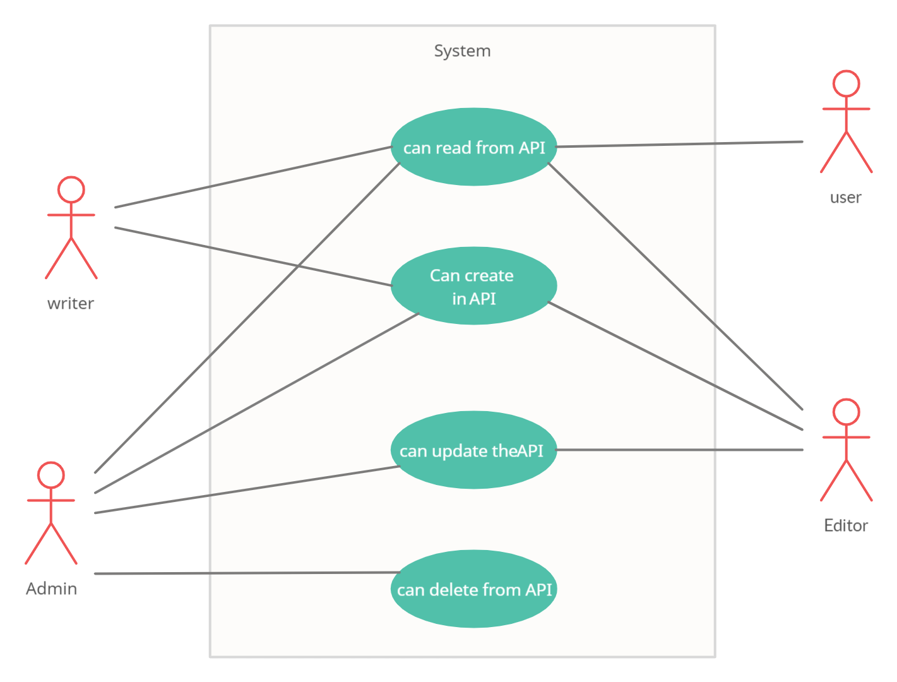

# auth-api

**Links and resourses:**

[ci/cd](https://github.com/malakMomani/auth-api/actions)

[Repo link](https://github.com/malakMomani/auth-api)

[PR link](https://github.com/malakMomani/auth-api/pull/1)

[Deployed heroku](https://malak-auth-api.herokuapp.com/)

UML Diagram :

WRRC :

